## Cel. 
Celem jest zapoznanie się z narzędziem Ansible

## Uruchomienie mastera i workerów

``` shell
docker compose up -d
```

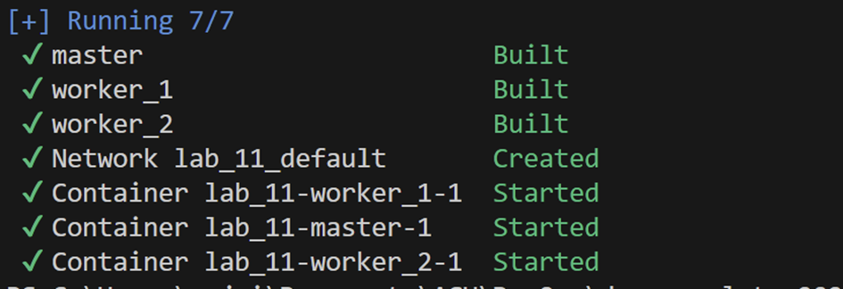

## Wugenerowanie kluczy ssh

``` shell
ssh-keygen -t ed25519
```

## Aktualizacja kluczy publicznych na workerach

``` shell
echo <PUBLIC_KEY> >> /root/.ssh/authorized_keys
```

## Sprawdzanie połączenia ssh z workerem_1

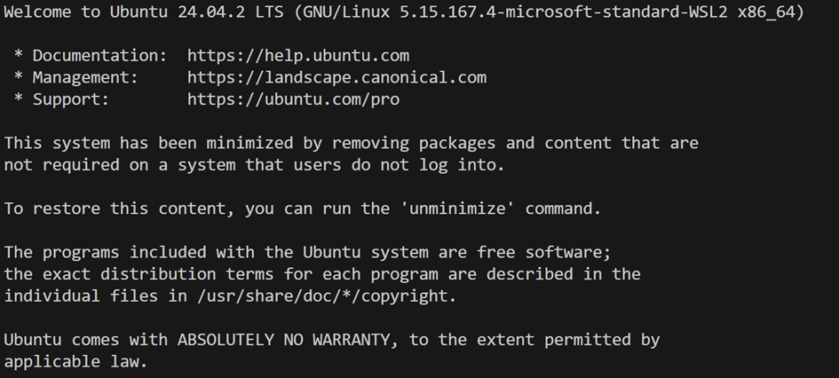

## Sprawdzanie połączenia ssh z workerem_2

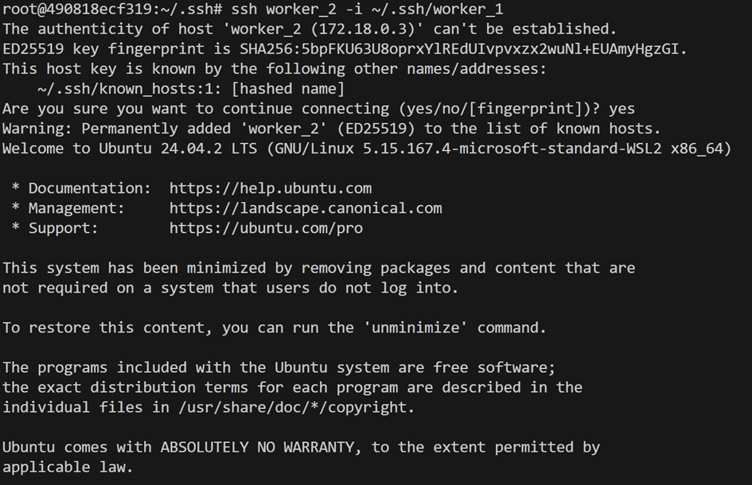

## Zainstalowanie ansbile na mastera za pomocą poleceń
```bash
apt update
apt install software-properties-common
add-apt-repository --yes --update ppa:ansible/ansible
apt install ansible
```

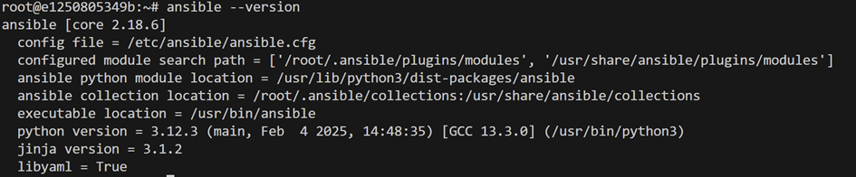

## Konfiguracja /etc/ansible/hosts i grupy workeres

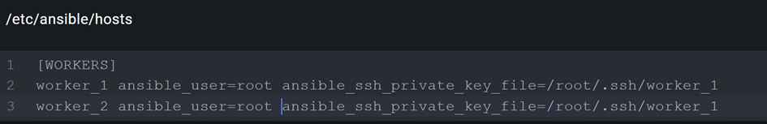

## Napisanie playbooka

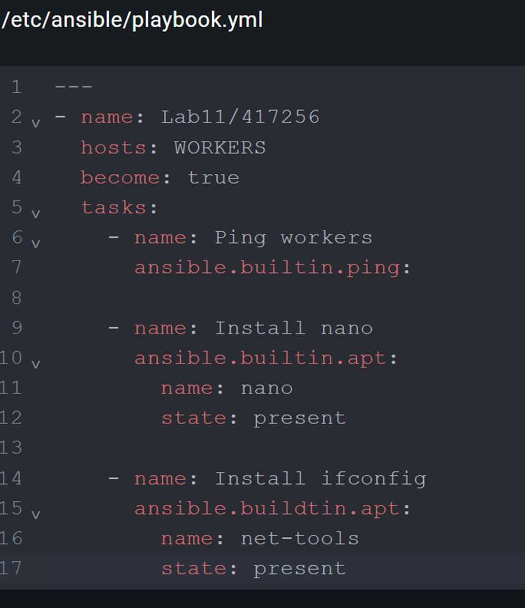

## Uruchomienie ansibla za pomocą polecenia
```bash
ansible-playbook -i /etc/ansible/hosts /etc/ansible/playbook.yml
```

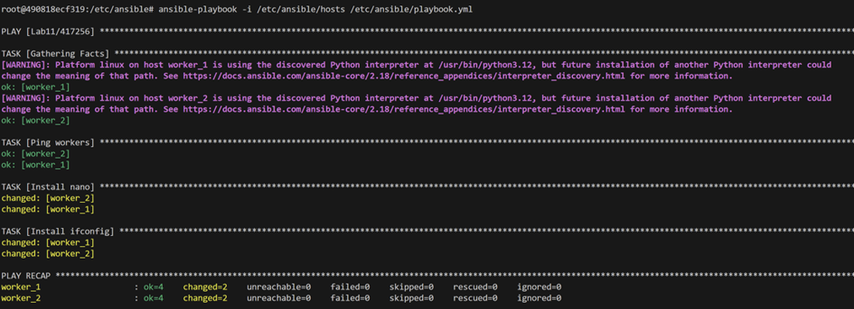

## Sprawdzenia działania na workerze 1 nano

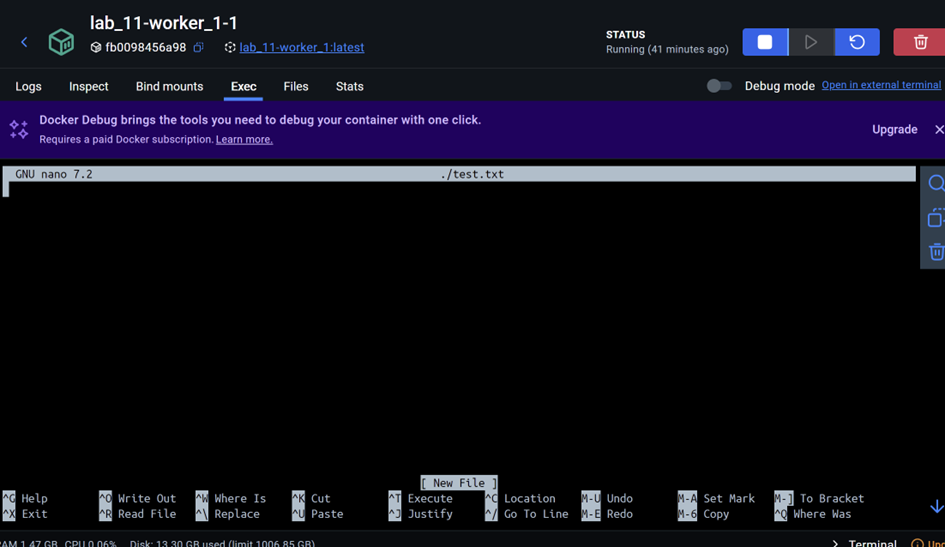

## Sprawdzenia działania na workerze 1 ifconfig

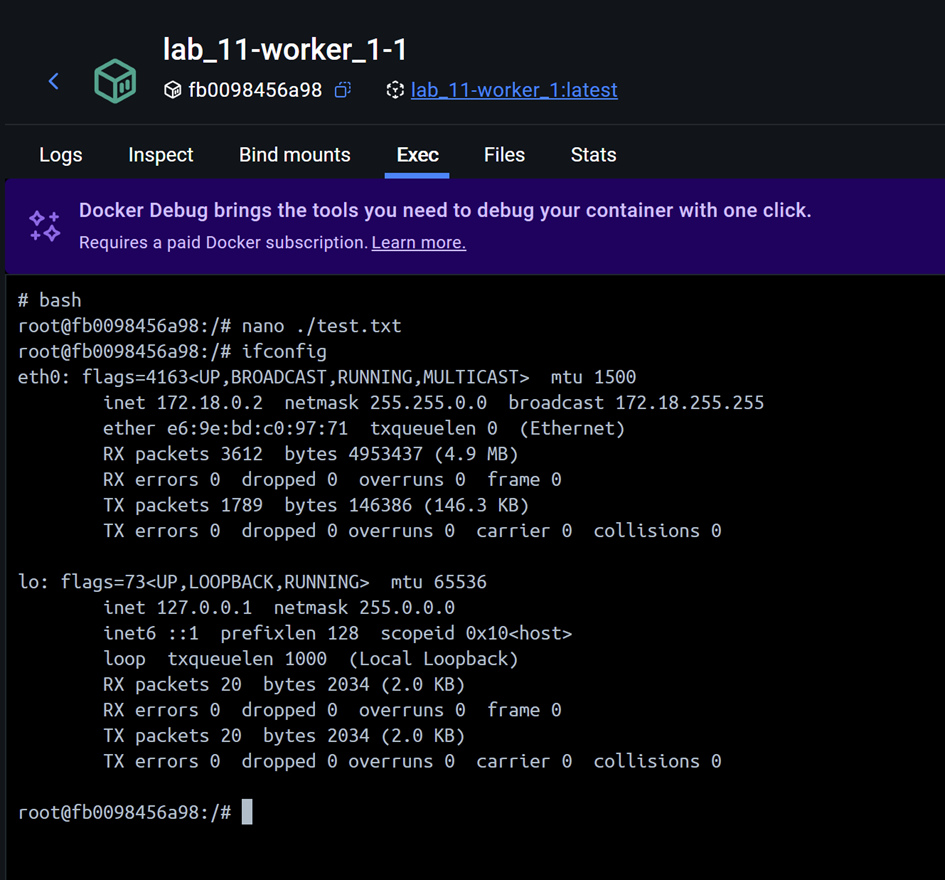

## Sprawdzenia działania na workerze 1 nano

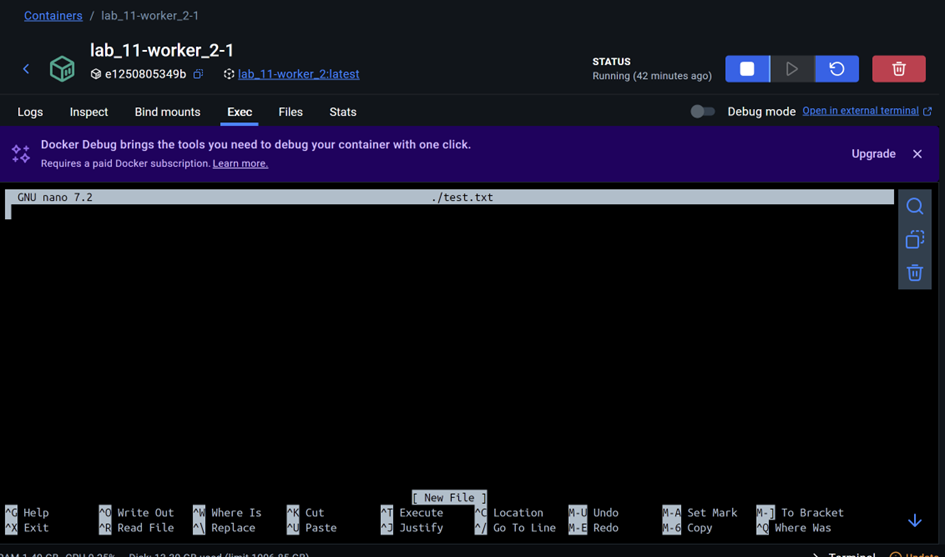

## Sprawdzenia działania na workerze 1 ifconfig

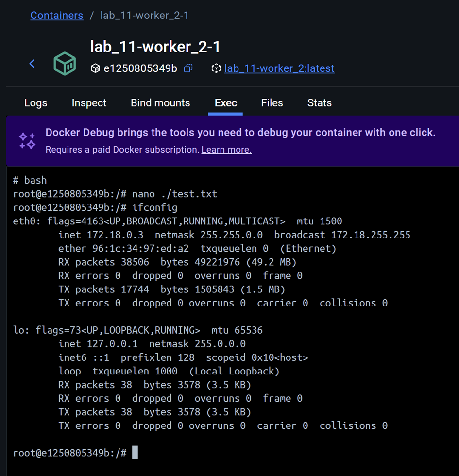