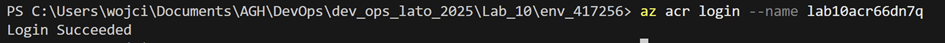

## Przebieg:
### 1. Zbudowanie obrazu Docker i wypchnięcie obrazu do repozytorium na Azure.
Dodanie subsctiption id w provider.tf:

``` bash
  subscription_id = "moja_subskrypcja"
```

Inicjacja terraforma za pomocą polecenia `terraform init`:

Utworzenie infrastruktury przy wykorzystaniu `terraform apply`:


Zbudowanie obrazu w oparciu o kod z main:


Sprawdzenie grupy zasobów:


Logowanie do Azure ACR:



Otagowanie obrazu:


Wypchnięcie obrazu do repozytorium:


### 2. Zalogowanie się do klastra K8s za pomocą Azure CLI i przetestowanie kubectl.
Dodanie poświadczeń:


Testowanie kubectl:


### 3. Wdrożenie obrazu na klaster K8s i uruchomienie testów funkcjonalnych.
Sprawdzenie hasła do ACR:


Utworzenie sekretu z poświadczeniami do ACR:

``` bash
kubectl create secret docker-registry regcred --docker-server=<your-registry-server> --docker-username=<your-name> --docker-password=<your-pword>
```


Sprawdzenie sekretu:


Edytowanie pliku deployment.yaml. Dodanie nazwy, obrazu, portu oraz nazwy imagePullSecrets:


Uruchomienie deploymentu:


Edycja service.yml. Dodanie portu, na którym pod wystawi aplikację i portu na którym działa aplikacja:


Uruchomienie serwisu:


Sprawdzenie serwisów za pomocą:


Forwardowanie portu:


Przetestowanie aplikacji:

