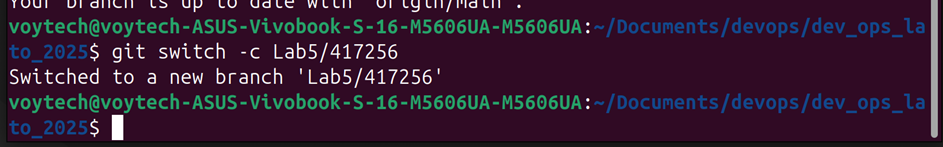

## Cel
Głównym celem laboratorium było zapoznanie się z narzędziem Docker Compose, które umożliwia definiowanie i uruchamianie wielokontenerowych aplikacji Docker. W ramach zadania należało skonfigurować środowisko uruchomieniowe dla aplikacji webowej.

## Przebieg

### 1. Przygotowanie środowiska
Zaktualizowano lokalną kopię repozytorium i utworzono nową gałąź roboczą dla zadania. Wykonano to poprzez:
- Pobranie najnowszych zmian z repozytorium zdalnego    
  

- Utworzenie nowej gałęzi roboczej o nazwie zawierającej numer laboratorium i indeksu   

### 2. Konfiguracja struktury projektu
Na podstawie dostarczonego szablonu `env_00000` utworzono nowy folder projektu o nazwie zawierającej numer indeksu. Struktura folderu obejmowała:
- Plik `requirements.txt` z zależnościami
- Główny plik aplikacji `app.py`
- Katalog `Docker` z plikiem konfiguracyjnym
- Plik `compose.yml` definiujący usługi 

### 3. Pierwsze uruchomienie aplikacji
Aplikację uruchomiono za pomocą komendy Docker Compose  

Po uruchomieniu:
- Sprawdzono działanie aplikacji pod adresem localhost  

- Zweryfikowano działanie licznika odwiedzin
- Wyświetlono listę aktywnych kontenerów w terminalu    

### 4. Implementacja trybu developerskiego
Zmodyfikowano plik compose.yml:
- Skonfigurowano synchronizację plików między hostem a kontenerem   

- Zmieniono w pliku app.py wyświetlany tekst    

- Uruchomiono aplikację w trybie developerskim  

- Przetestowano automatyczne przeładowanie aplikacji po zmianach w kodzie   

### 5. Obserwacje zachowania aplikacji
Podczas testowania zauważono, że:
- Zmiany w tekście były widoczne natychmiast po odświeżeniu strony
- Licznik odwiedzin nie resetował się pomiędzy zmianami, ponieważ jest przechowywany w zewnętrznej usłudze Redis, który działa w osobnym kontenerze, który nie został zrestartowany podczas używania docker compose watch
- Aplikacja poprawnie reagowała na modyfikacje kodu

### 6. Modyfikacja portów
Zmieniono konfigurację portów tak, aby aplikacja była dostępna na porcie 8080. Wymagało to:
- Aktualizacji pliku compose.yml

- Ponownego uruchomienia kontenerów

- Weryfikacji dostępności pod nowym adresem

## Wnioski
1. Docker Compose znacznie ułatwia zarządzanie wieloma kontenerami
2. Tryb developerski z hot-reload przyspiesza proces tworzenia aplikacji
3. Oddzielenie kodu od infrastruktury ułatwia rozwój i wdrażanie
4. Konfiguracja portów wymaga uwzględnienia zarówno hosta jak i kontenera