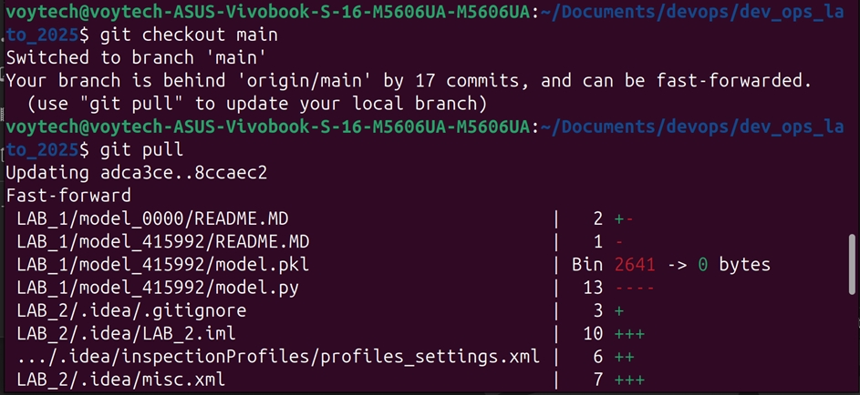
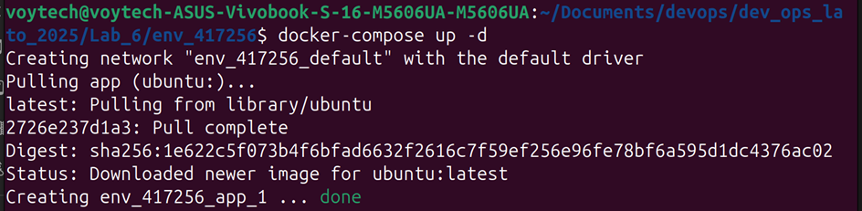
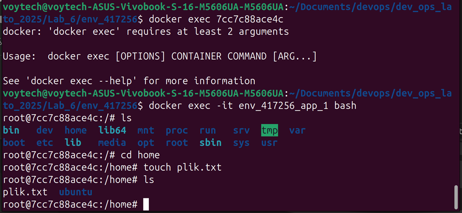
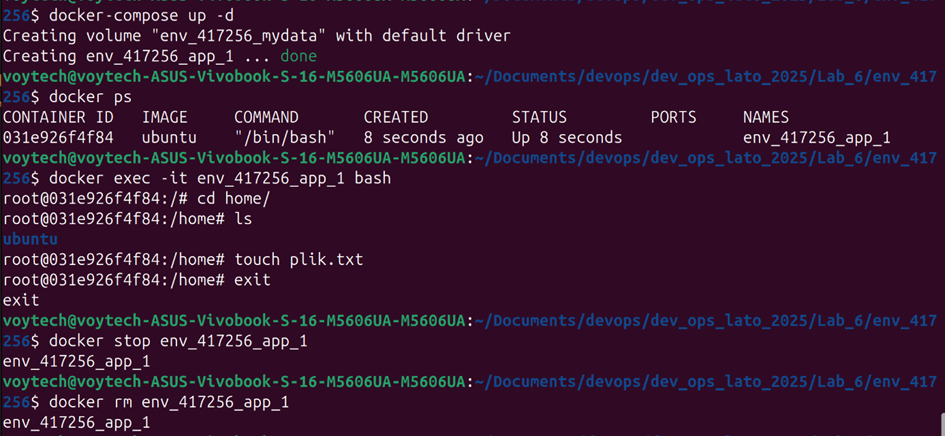
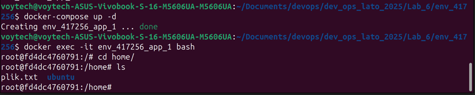
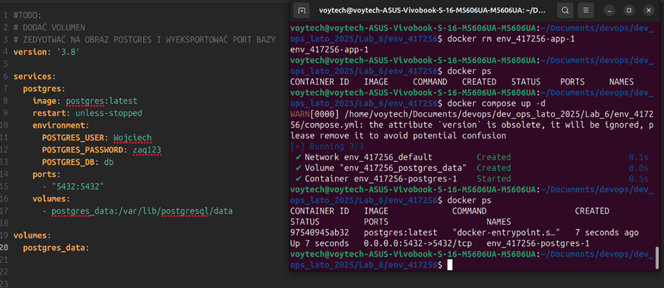
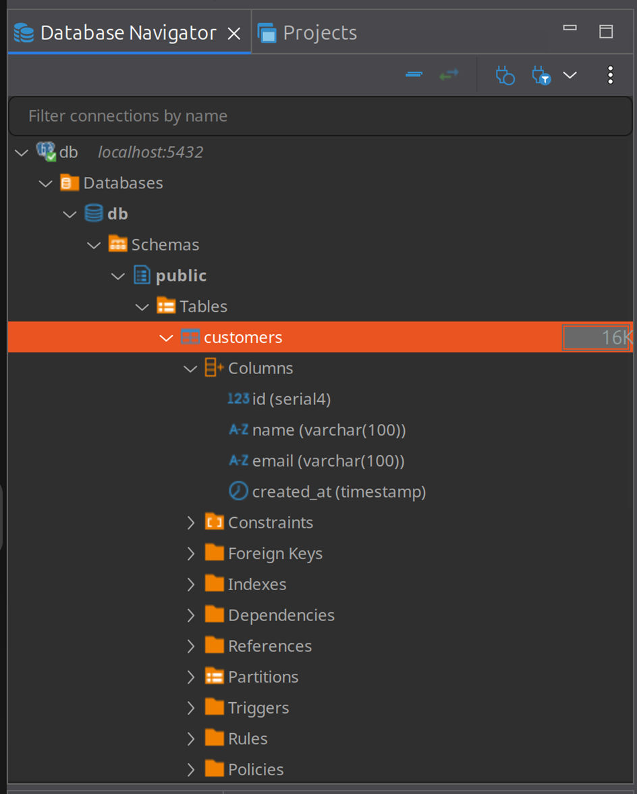
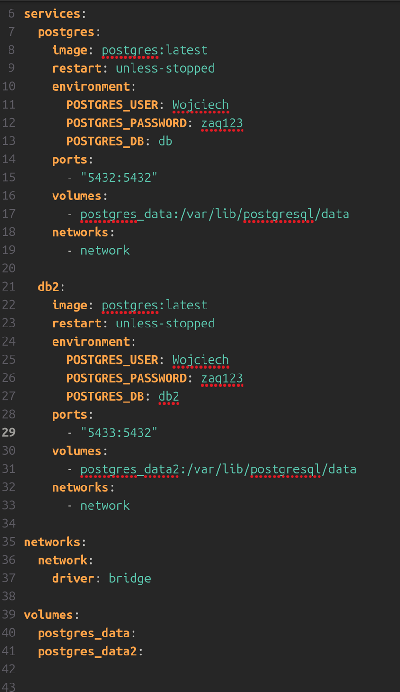
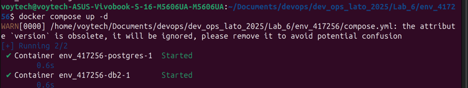
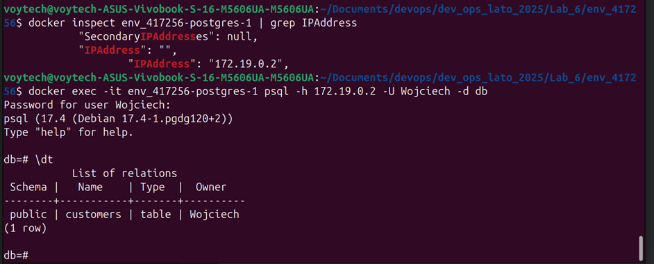

## Cel
Celem zajęć było praktyczne zapoznanie się z mechanizmami Docker Compose, w szczególności z:
- Zarządzaniem trwałymi danymi poprzez volumeny
- Konfiguracją sieci między kontenerami
- Eksportem portów usług

## Przebieg

### 1. Przygotowanie środowiska roboczego

Na początku wykonałem aktualizację lokalnego repozytorium. Jak widać na zrzucie ekranu:
1. Przełączyłem się na gałąź główną (`git checkout main`)
2. Pobrałem najnowsze zmiany (`git pull`)

### 2. Stworzyłem folder w oparciu o env_00000

### 3.1 Pierwsze uruchomienie kontenera

Na podstawie zrzutu widzimy:
1. Uruchomienie kontenera Ubuntu (`docker-compose up -d`)
2. Proces pobierania obrazu Ubuntu
3. Utworzenie domyślnej sieci Docker
4. Pomyślne uruchomienie kontenera

### 3.2 Testowanie kontenera bez volumenu

Zrzut dokumentuje:
1. Próba wykonania polecenia w kontenerze (`docker exec`)
2. Poprawne podłączenie się do kontenera (`docker exec -it env_417256_app_1 bash`)
3. Utworzenie pliku testowego w katalogu /home (`touch plik.txt`)
4. Weryfikacja istnienia pliku (`ls`)

### 3.3 Test trwałości danych

Na zrzucie widzimy:
1. Zatrzymanie i usunięcie kontenera (`docker stop`, `docker rm`)
2. Ponowne uruchomienie kontenera (`docker-compose up -d`)
3. Sprawdzenie zawartości katalogu /home - plik zniknął, co potwierdza nietrwałość danych bez volumenu

### 4.1 Implementacja volumenu

Zrzuty pokazują:
1. Modyfikację pliku docker-compose.yml
2. Dodanie konfiguracji volumnu mapującego katalog /home
3. Definicję volumnu "mydata"

### 4.2, 4.3, 4.4 Test działania volumnu

Na zrzucie dokumentujemy:
1. Uruchomienie kontenera z volumnem (`docker-compose up -d`)
2. Utworzenie pliku testowego w /home (`touch pltk.txt`)
3. Zatrzymanie i usunięcie kontenera
4. Po ponownym uruchomieniu plik był dostępny

### 5. Sieć docker i eksport portów
Zmodyfikowałem docker compose tak aby uruchomić obraz postgres w oparciu o dokumentacje

Podłączyłem się do bazy danych za pomocą DBeaver i dodałem tabelę customers

Zmodyfikowałem docker compose tak aby uruchomić dwa kontenery we wspólnej sieci

Sprawdziłem czy kontenery działają

Sprawdziłem jakie ip ma kontener następnie połączyłem się z bazą danych i sprawdziłem czy tabela się w nim znajduje.
