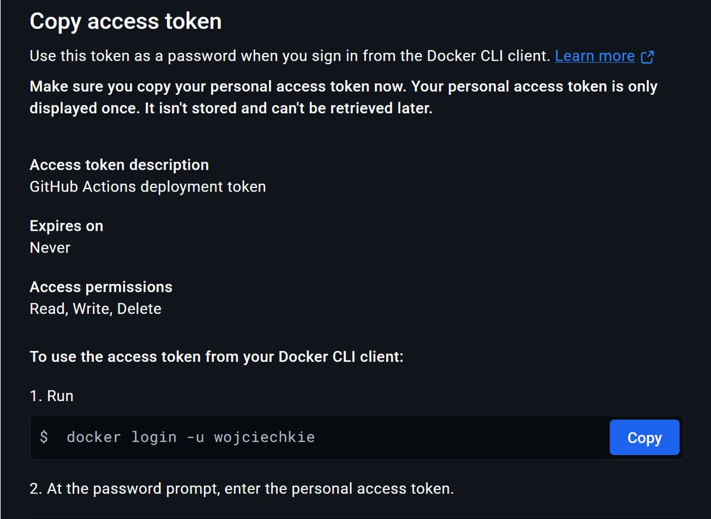
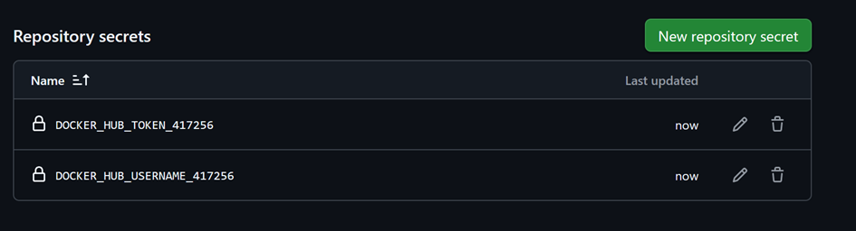
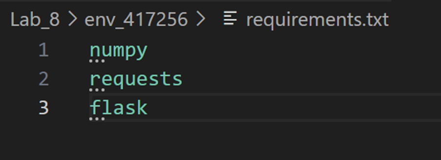
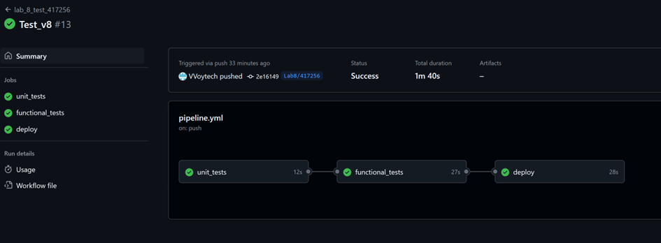
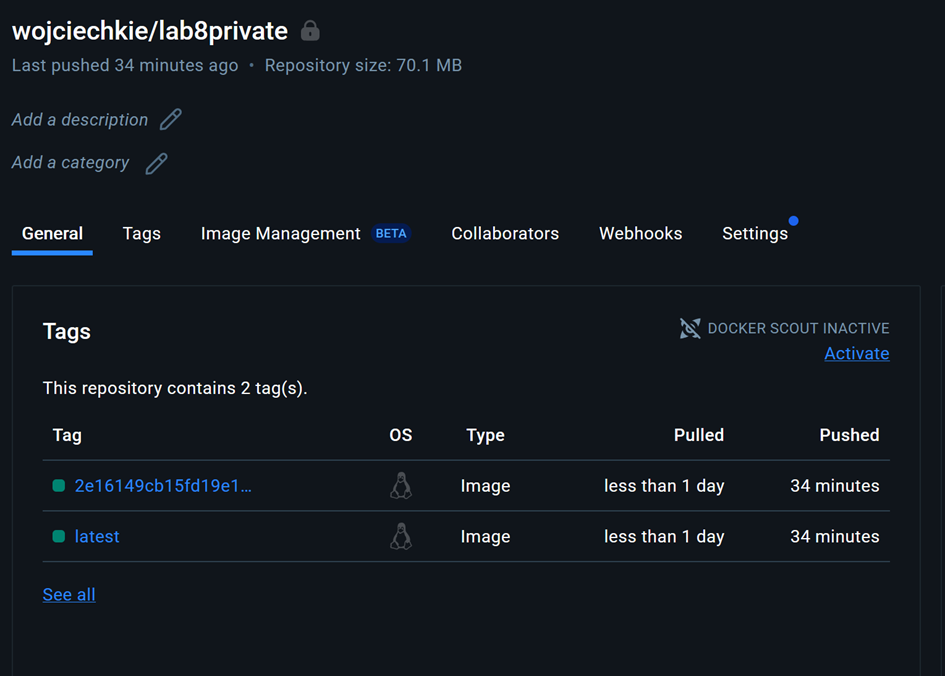
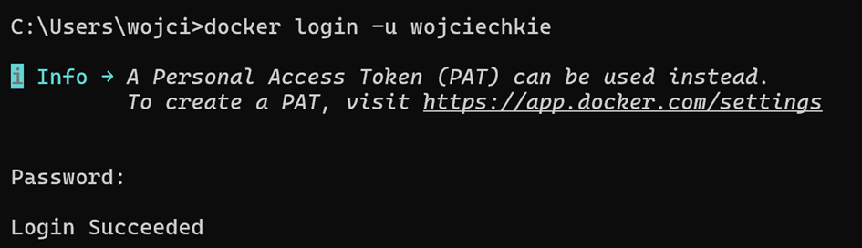
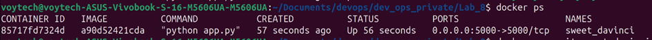
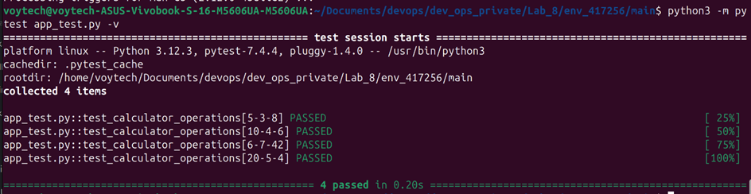

## Wstęp

Celem było zapoznanie się z narzędziem GitHub Actions, obsługą sekretów oraz procesem deployowania obrazów kontenerów do zdalnego repozytorium Docker Hub. Zadanie wykonywane było samodzielnie na własnym koncie.

## Krok po kroku – przebieg

2.1 Aktualizacja repozytorium

    Pobranie wszystkich zmian z repozytorium zdalnego:

`git fetch --all`

Przełączenie na gałąź main:

`git checkout main`

Pobranie najnowszych zmian z main:

`git pull`

Utworzenie własnej gałęzi roboczej i przełączenie się na nią:

`git checkout -b Lab8/417256`

2.2 Przygotowanie konta Docker Hub

    Utworzenie konta na Docker Hubie.

    Zalogowanie się na swoje konto.

    Utworzenie prywatnego repozytorium na obrazy kontenerów.

    Wygenerowanie tokenu dostępu (w ustawieniach profilu) i skopiowanie go – token nie jest możliwy do ponownego odczytu.

2.3 Dodanie sekretów do GitHub Actions

    W repozytorium GitHub przejście do zakładki Settings → Secrets and variables → Actions.

    Dodanie nowych sekretów:

        docker_hub_username_417256 – nazwa użytkownika Docker Hub

        docker_hub_token_417256 – wygenerowany token dostępu
    
    

2.4 Przygotowanie środowiska

    Skopiowanie zawartości folderu env_00000 do nowego folderu:

`cp -r env_00000 env_417256`

2.5 Konfiguracja workflow w GitHub Actions

Workflow został skonfigurowany w pliku .github/workflows/pipeline.yml według poniższego schematu:

    name: lab_8_test_417256

    on:
    push:
        branches:
        - Lab8/417256

    jobs:
    unit_tests:
        runs-on: ubuntu-latest
        steps:
        - uses: actions/checkout@v3
        - name: Set up Python
        uses: actions/setup-python@v4
        with:
            python-version: '3.11'
        - name: Install libs for testing
        run: pip install pytest
        - name: Install dependencies
        run: |
            cd ./Lab_8/env_417256 && python -m pip install -r requirements.txt
        - name: Run unit tests
        run: |
            cd ./Lab_8/env_417256/main && pytest calculator_test.py

    functional_tests:
        needs: unit_tests
        runs-on: ubuntu-latest
        steps:
        - uses: actions/checkout@v3
        - name: Set up Python
        uses: actions/setup-python@v4
        with:
            python-version: '3.11'
        - name: Install libs for testing
        run: pip install pytest
        - name: Install dependencies
        run: |
            cd ./Lab_8/env_417256 && python -m pip install -r requirements.txt
        - name: Run app
        run: |
            cd ./Lab_8/env417256/main && nohup python app.py &
        - name: Sleep
        run: sleep 10
        - name: Run functional tests
        run: |
            cd ./Lab_8/env_417256/main && pytest app_test.py

    deploy:
        needs: functional_tests
        runs-on: ubuntu-latest
        steps:
        - uses: actions/checkout@v3
        - name: Login to Docker Hub
        uses: docker/login-action@v2
        with:
            username: ${{ secrets.docker_hub_username_417256 }}
            password: ${{ secrets.docker_hub_token_417256 }}
        - name: Build and push
        uses: docker/build-push-action@v4
        with:
            context: ./Lab_8/env_417256
            file: ./Lab_8/env_417256/Dockerfile
            push: true
            tags: |
            wojciechkie/lab8private:latest
            wojciechkie/lab8private:${{ github.sha }}

2.6 Dodanie importów do requrements.txt

    Przed uruchomieniem workflow dodane zostały biblioteki, które są wykorzystywane w aplikacji.

2.7 Testowanie workflow

    Zmiany zostały wypchnięte na github następnie w zakładce github actions sprawdzone zostało czy testy przeszły.

    Kolejnym zadaniem było sprawdzenie czy w docker hub został zbudowany obraz kontenera.
    

2.8 Testowanie obrazu lokalnie

    Pobranie obrazu na lokalny komputer:

`docker login`

`docker pull wojciechkie/lab8private:latest`

Uruchomienie obrazu:

`docker run -d -p 5000:5000 wojciechkie/lab8private:latest`

Uruchomienie testów funkcjonalnych lokalnie:

`cd Lab_8/env_417256/main`
`pytest app_test.py`

