## Wstęp
Laboratorium miało na celu praktyczne zapoznanie się z:
- Konfiguracją GitHub Actions
- Automatyzacją testów jednostkowych
- Tworzeniem złożonych workflow
- Pracą z Gitem w środowisku zespołowym

## Przebieg prac

### 1. Przygotowanie środowiska developerskiego
1. **Synchronizacja repozytorium**  
   - Wykonałem `git checkout main` i `git pull` aby zsynchronizować lokalną kopię z repozytorium zdalnym

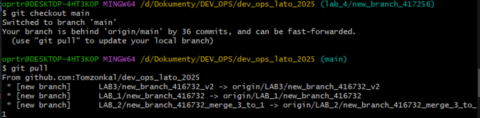

### 2. Stworzenie własnego repozytorium
1. **Prywatne repozytorium**
    - Utworzyłem nowy branch roboczy `Lab7/417256` komendą `git switch -c`

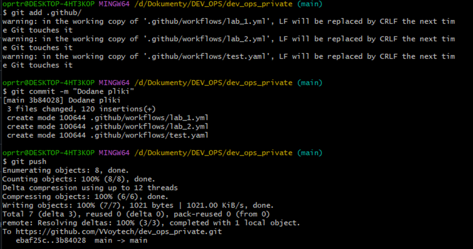

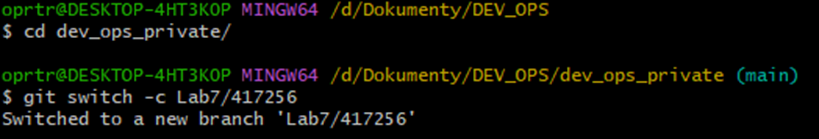

2. **Struktura projektu**  
   - Skopiowałem zawartość folderu `env_00000` do nowego katalogu `env_417256`
   - Przygotowałem odpowiednią strukturę plików:
     ```
     Lab_7/
     └── env_417256/
         ├── calculator.py
         ├── calculator_test.py
         ├── requirements.txt
         └── README.md
     ```

### 3. Testowanie tylko na branchu roboczym
1. **Modyfikacja pipeline**  
    - Zmodyfikowałem plik `.github/workflows/pipeline.yml`:
    - Ustawiłem trigger tylko dla brancha `Lab7/417256`

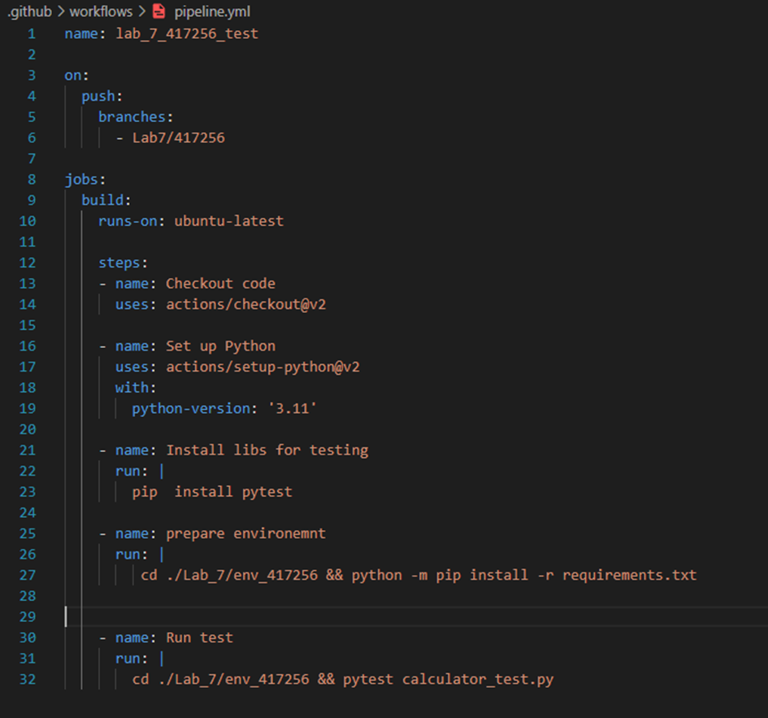

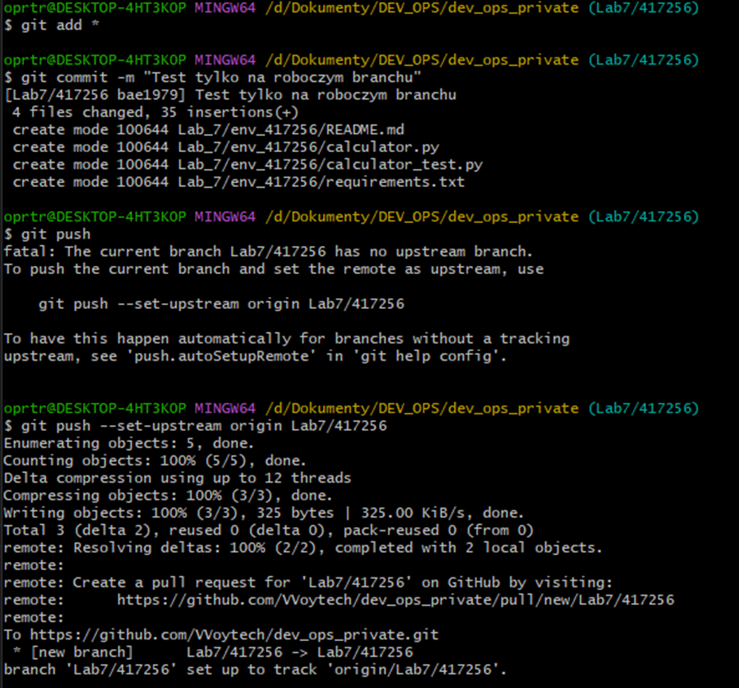

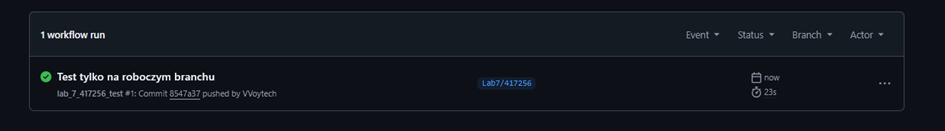

### 4. Rozwój funkcjonalności
1. **Modyfikacja kodu źródłowego**  
   - Rozszerzyłem plik `calculator.py` o nowe funkcje wykorzystujące:
     - NumPy do operacji matematycznych
     - Pandas do obliczeń statystycznych

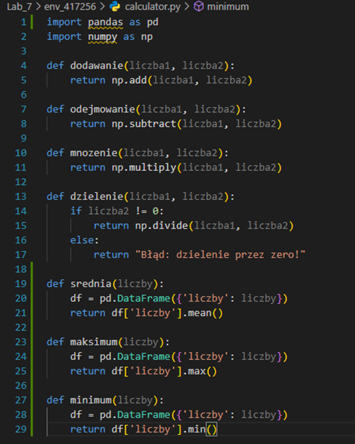

2. **Testy jednostkowe**  
   - Stworzyłem kompleksowe testy w pliku `calculator_test.py`
   - Podzieliłem testy na grupy funkcjonalne:
     - Podstawowe operacje matematyczne
     - Funkcje statystyczne

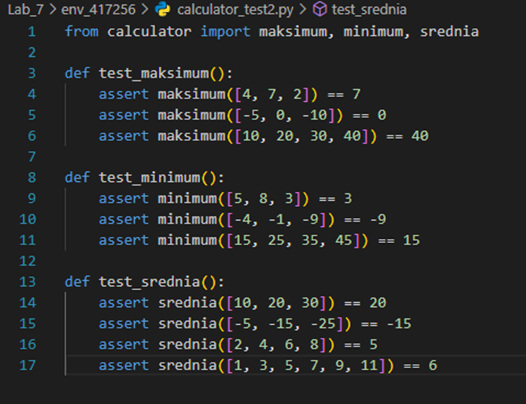

4. **Plik workflow**  
   - Zmodyfikowałem plik `.github/workflows/pipeline.yml`:
     - Zdefiniowałem środowisko wykonawcze (Ubuntu + Python 3.11)
     - Dodałem kroki instalacji zależności

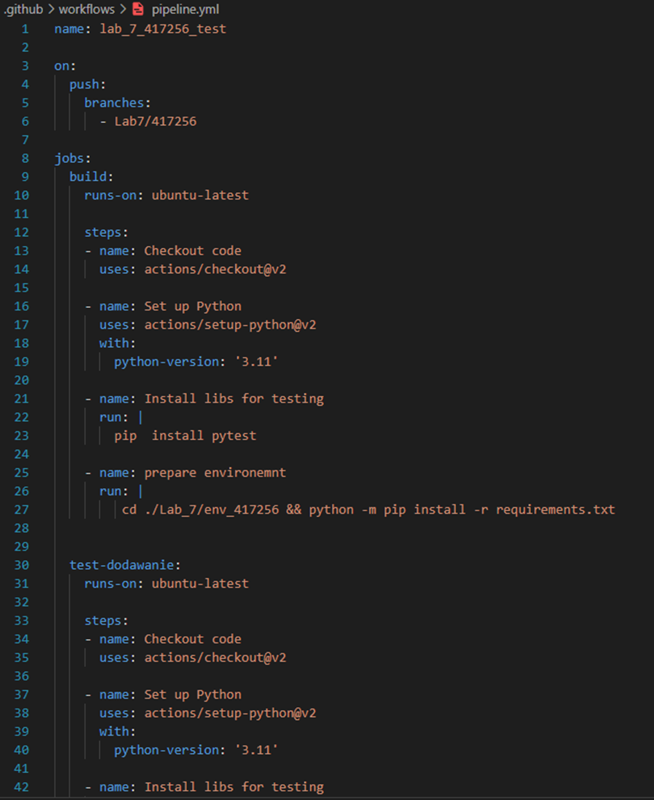

5. **Zaawansowana konfiguracja jobów**  
   - Zaimplementowałem równoległe wykonanie 4 jobów testowych
   - Skonfigurowałem nowe joby `test_maksimum`, `test_minimum`, `test_srednia` zależny od poprzednich dzięki `needs`
   - Dodałem odpowiednie ścieżki do testów w każdym jobie

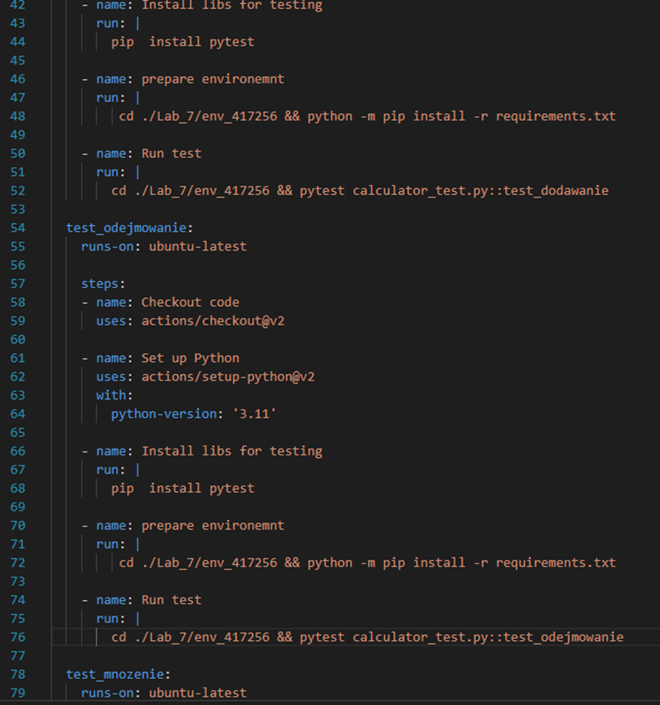

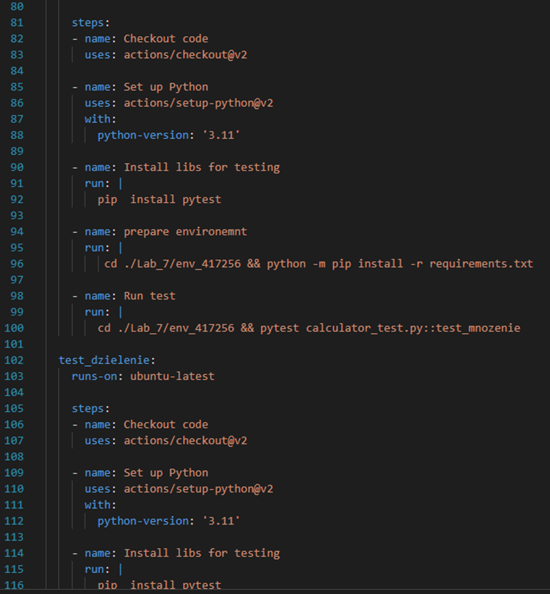

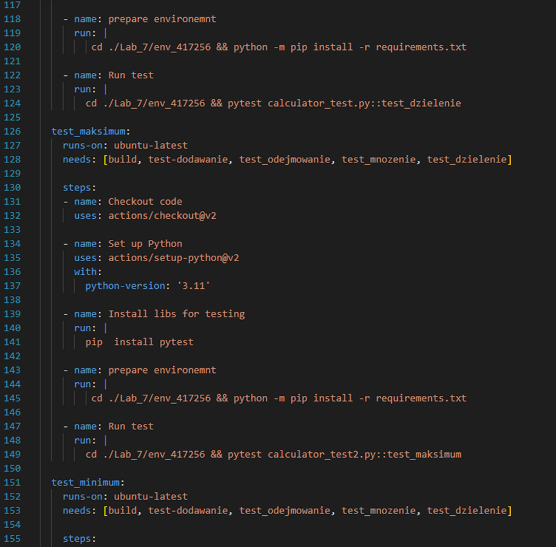

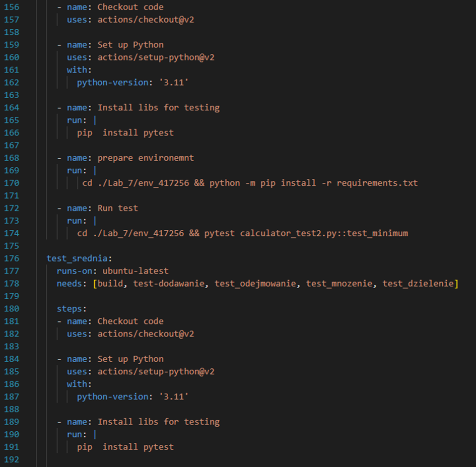

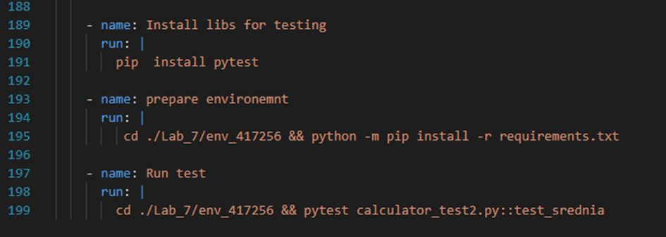

6. **Integracja z GitHub**  
   - Wykonałem commit i push na zdalny branch
   - Śledziłem wykonanie workflow w zakładce Actions
   - Analizowałem logi w przypadku niepowodzeń

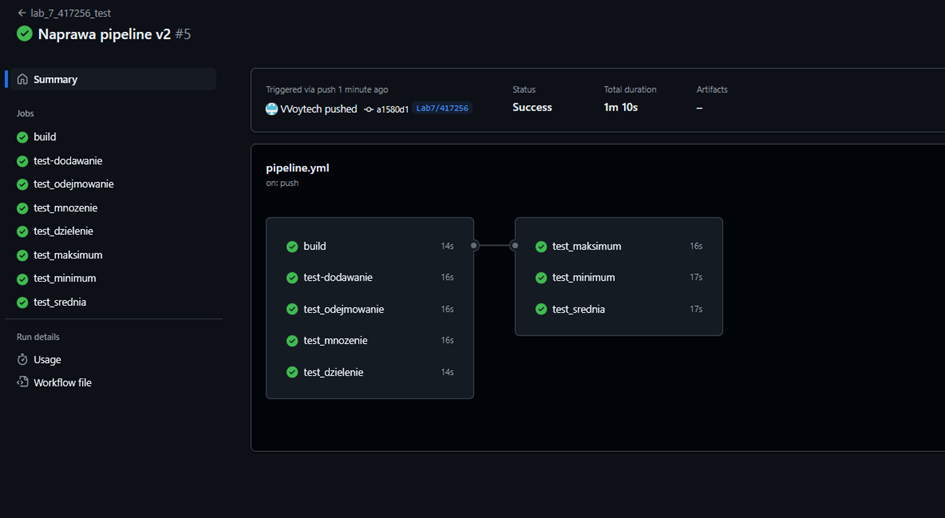

## Wyniki
1. **Działający pipeline**  
   - Workflow poprawnie wykonuje się przy każdym pushu
   - Wszystkie testy przechodzą pomyślnie


## Wnioski
1. **Doświadczenia**  
   - GitHub Actions zapewnia elastyczność w konfiguracji pipeline'ów
   - Równoległe joby znacząco przyspieszają proces CI
   - Ważne jest odpowiednie grupowanie testów