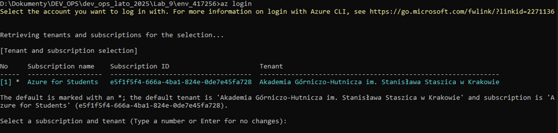
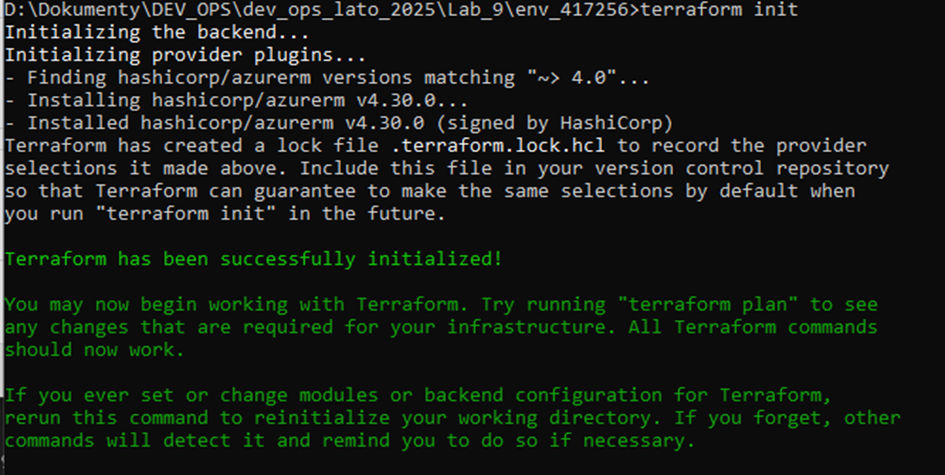
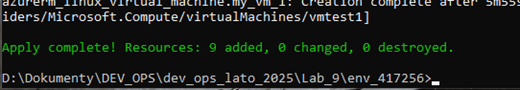
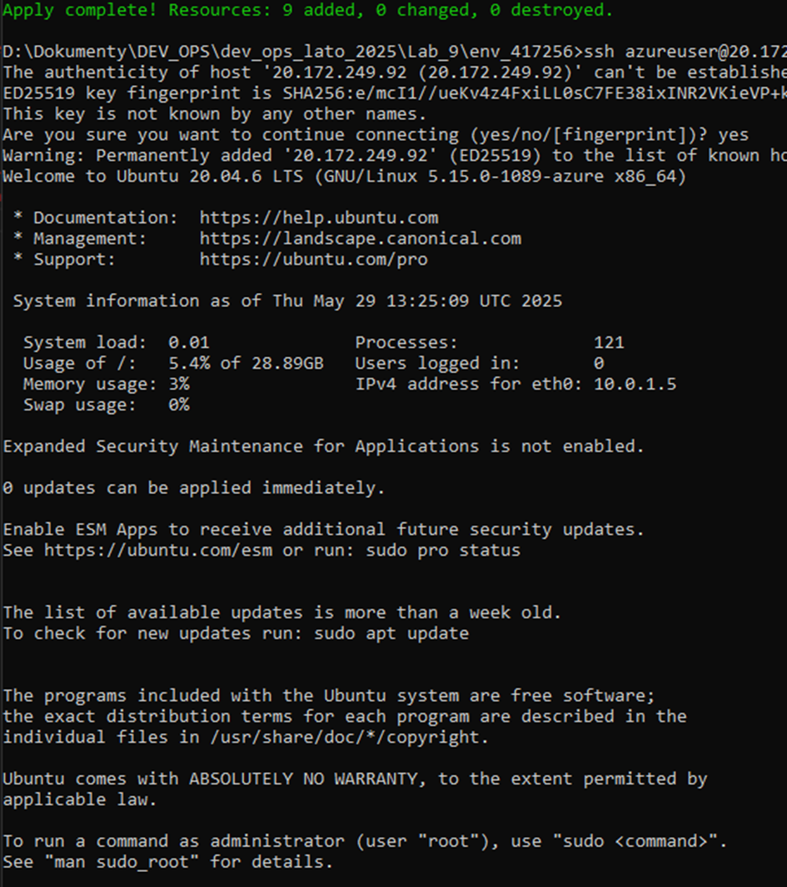
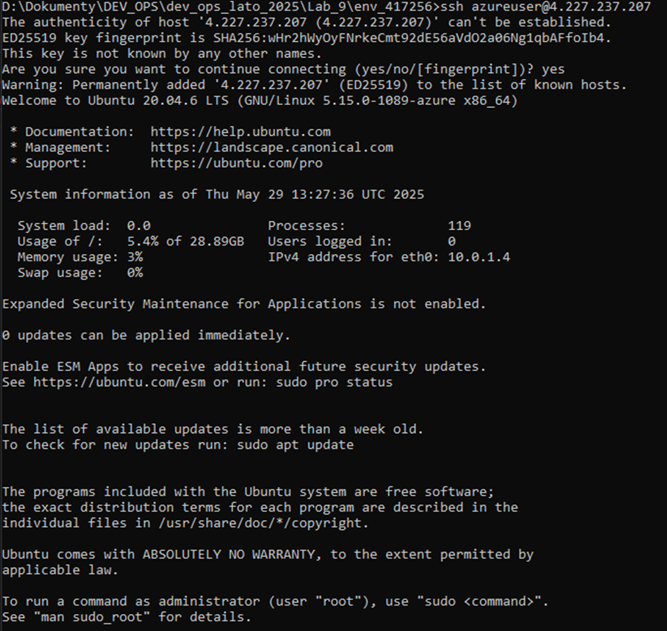
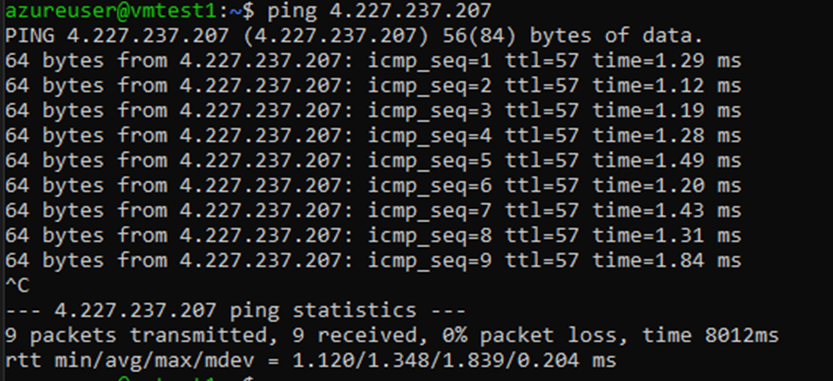

## Cel:
Celem jest zapoznanie się z narzędziem Terraform, jako koncepcja IaC.

## Przebieg:

### 1. Zaktualizowanie repozytorium.
Do zaktualizowania wszystkich metadanych projektu używamy polecenia `git fetch --all`:

Następnie przełączamy się na branch main korzystając z polecenia `git checkout main`:

I pobieramy wszystkie zmiany w kodzie za pomocą `git pull`:


Stworzenie brancha roboczego i przełączenie się na niego za pomocą `git switch -c`:


Skopiowanie zawartości do nowego folderu env_417425:


### 2. Uzupełnienie danych w provider.tf oraz variables.tf.

Dodanie subsctiption id w provider.tf:

``` bash
  subscription_id = "moje_sub_id"
```

Dodanie publicznego ip w variables.tf:

``` bash
  default = "<moje_publiczne_id>/32"
```

### 3. Stworzenie infrastruktutry za pomocą TF.
Utworzenie resource group: 

``` bash<moje_publiczne_id>/32
resource "azurerm_resource_group" "main" {
    name     = var.resource_group_name
    location = var.resource_group_location
}
```

Utworzenie sieci:

``` bash
resource "azurerm_virtual_network" "main" {
    name                = "vnet-test"
    address_space       = ["10.0.0.0/16"]
    location            = azurerm_resource_group.main.location
    resource_group_name = azurerm_resource_group.main.name
}
```

Utworzenie podsieci:

``` bash
resource "azurerm_subnet" "main" {
    name                 = "subnet-test"
    resource_group_name  = azurerm_resource_group.main.name
    virtual_network_name = azurerm_virtual_network.main.name
    address_prefixes     = ["10.0.1.0/24"]
}
```

Utworzenie Network Security Group blokującego połączenia z maszynami i pozwalający tylko na nasze ip:

``` bash
resource "azurerm_network_security_group" "main" {
    name                = "nsg-test"
    location            = azurerm_resource_group.main.location
    resource_group_name = azurerm_resource_group.main.name

    security_rule {
        name                       = "Allow-SSH-From-MyIP"
        priority                   = 100
        direction                  = "Inbound"
        access                     = "Allow"
        protocol                   = "Tcp"
        source_port_range          = "*"
        destination_port_range     = "22"
        source_address_prefix      = var.my_public_ip
        destination_address_prefix = "*"
    }

    security_rule {
        name                       = "Deny-All-Inbound"
        priority                   = 200
        direction                  = "Inbound"
        access                     = "Deny"
        protocol                   = "*"
        source_port_range          = "*"
        destination_port_range     = "*"
        source_address_prefix      = "*"
        destination_address_prefix = "*"
    }
}
```

Utworzenie dwóch maszyn wirtualnych z publicznym IP:

``` bash
resource "azurerm_public_ip" "vm_ip_1" {
    name                = "publicip-test1"
    location            = azurerm_resource_group.main.location
    resource_group_name = azurerm_resource_group.main.name
    allocation_method   = "Dynamic"
    sku                 = "Basic"
}

resource "azurerm_network_interface" "vm_nic_1" {
    name                = "nic-test1"
    location            = azurerm_resource_group.main.location
    resource_group_name = azurerm_resource_group.main.name

    ip_configuration {
        name                          = "ipconfig"
        subnet_id                     = azurerm_subnet.main.id
        private_ip_address_allocation = "Dynamic"
        public_ip_address_id          = azurerm_public_ip.vm_ip_1.id
    }
}

resource "azurerm_linux_virtual_machine" "my_vm_1" {
    name                = "vmtest1"
    resource_group_name = azurerm_resource_group.main.name
    location            = azurerm_resource_group.main.location
    size                = "Standard_D2s_v3"
    admin_username      = "azureuser"
    network_interface_ids = [
        azurerm_network_interface.vm_nic_1.id
    ]

    admin_ssh_key {
    username   = "azureuser"
    public_key = "ssh-ed25519..."
  } 

    os_disk {
        caching              = "ReadWrite"
        storage_account_type = "Standard_LRS"
       // name                 = "osdisk_test_1"
    }

    source_image_reference {
        publisher = "Canonical"
        offer     = "0001-com-ubuntu-server-focal"
        sku       = "20_04-lts"
        version   = "latest"
    }

    disable_password_authentication = true
}

resource "azurerm_public_ip" "vm_ip_2" {
    name                = "publicip-test2"
    location            = azurerm_resource_group.main.location
    resource_group_name = azurerm_resource_group.main.name
    allocation_method   = "Dynamic"
    sku                 = "Basic"
}

resource "azurerm_network_interface" "vm_nic_2" {
    name                = "nic-test2"
    location            = azurerm_resource_group.main.location
    resource_group_name = azurerm_resource_group.main.name

    ip_configuration {
        name                          = "ipconfig"
        subnet_id                     = azurerm_subnet.main.id
        private_ip_address_allocation = "Dynamic"
        public_ip_address_id          = azurerm_public_ip.vm_ip_2.id
    }
}

resource "azurerm_linux_virtual_machine" "my_vm_2" {
    name                = "vmtest2"
    resource_group_name = azurerm_resource_group.main.name
    location            = azurerm_resource_group.main.location
    size                = "Standard_D2s_v3"
    admin_username      = "azureuser"
    network_interface_ids = [
        azurerm_network_interface.vm_nic_2.id
    ]

    admin_ssh_key {
    username   = "azureuser"
    public_key = "ssh-ed25519..."
  } 

    os_disk {
        caching              = "ReadWrite"
        storage_account_type = "Standard_LRS"
        //name                 = "osdisk_test_2"
    }

    source_image_reference {
        publisher = "Canonical"
        offer     = "0001-com-ubuntu-server-focal"
        sku       = "20_04-lts"
        version   = "latest"
    }

    disable_password_authentication = true
}

```

### 4. Uruchomienie terraforma.
Połączenie z azure za pomocą `az login`:



Inicjacja terraform wykorzystując `terraform init`:



Utworzenie infrastruktury za pomocą `terraform apply`:



### 5. Skomunikowanie się z obiema maszynami za pomocą SSH.
Łączymy się za pomocą polecenia `ssh azureuser@adres_ip_1_vm`:



Łączymy się za pomocą polecenia `ssh azureuser@adres_ip_2_v`m` do drugiej maszyny wirtualnej:



Do sprawdzenia komunikacji pomiędzy dwiema maszynami wykorzystujemy `ping adres_ip`:



Niszczymy infrastrukturę wykorzystując polecenie `terraform destroy`.

Celem było praktyczne wykorzystanie Terraform jako narzędzia IaC do zarządzania infrastrukturą w chmurze Azure. Wykonane zadania potwierdziły skuteczność podejścia „infrastructure as code” w automatyzacji procesów wdrażania i niszczenia zasobów

Kluczowe osiągnięcia:

Utworzono kompleksową infrastrukturę (resource group, sieć, podsieć, dwie maszyny wirtualne) z wykorzystaniem konfiguracji HCL

Skonfigurowano reguły bezpieczeństwa ograniczające dostęp SSH wyłącznie do wskazanego adresu IP, co zwiększyło bezpieczeństwo środowiska

Przeprowadzono testy łączności między maszynami, potwierdzając poprawność konfiguracji sieciowej.
